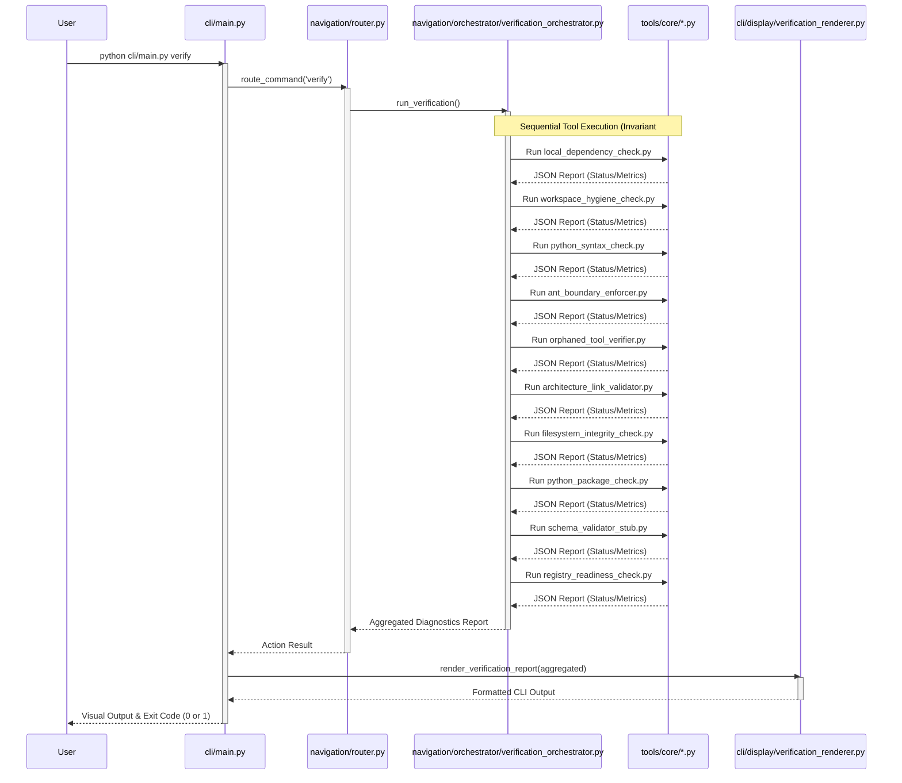

# Execution Intelligence Flow

This document maps the sequential execution of the active Intelligence Layer (Verification Pipeline). It details the flow from the user invoking the CLI down to the individual core tools, highlighting the single, deterministic path of execution to maintain **Invariant #9 (Linear Pipeline)**.

## Architectural Notes
- The orchestrator maintains absolute control over the sequence. No tool is allowed to invoke another tool directly.
- The interface between `verification_orchestrator.py` and the core tools is strictly JSON over stdout.
- The `Renderer` layer never interacts directly with `tools/core/`. It only parses the aggregated dictionary strictly conforming to `verification_output_format.md`.
