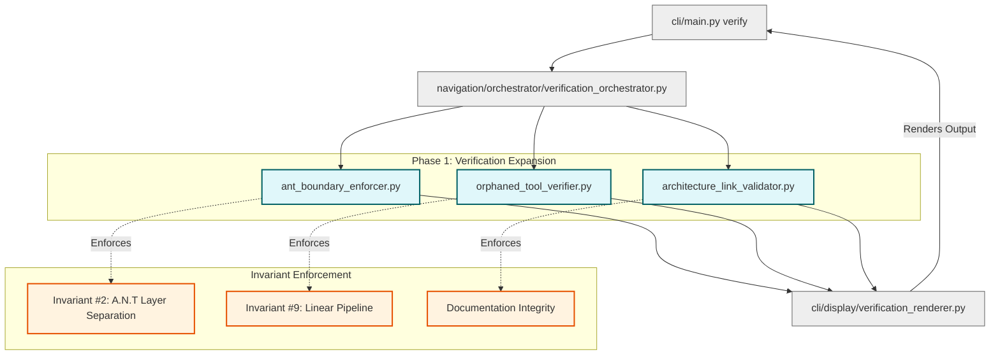

# Expansion Cycle 4 Map

This diagram visualizes the structural additions made during **Expansion Cycle #4 (Execution Intelligence Layer)**. It showcases the three new verification tools introduced, their integration points, and how they strengthen the overarching structural invariants.

## Key Components Added
1. **A.N.T Boundary Enforcer**: Uses AST to scan for cross-layer imports (e.g., `tools/` attempting to import from `cli/`), directly protecting **Invariant #2**.
2. **Orphaned Tool Verifier**: Dynamically cross-references the pipeline registry with actual physical files in `tools/core/`, ensuring **Invariant #9** is preserved and no tool operates invisibly.
3. **Architecture Link Validator**: Resolves all relative Markdown links in the `architecture/` directory to prevent documentation rot and broken referential integrity.
